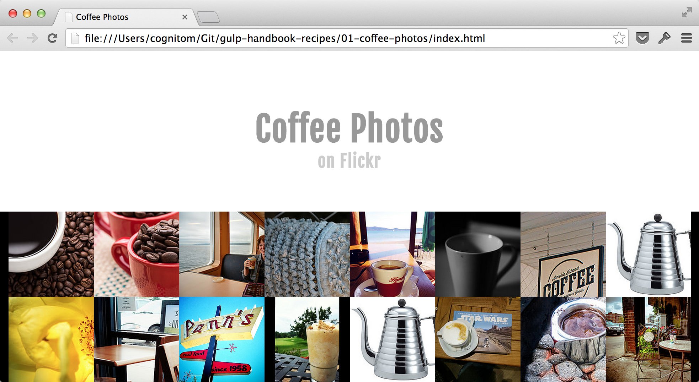

# Coffee Photos

This example is a part of [Recipes in gulp.js Handbook](https://github.com/cognitom/gulp-handbook-recipes/).

It aims to be a smallest project that works with gulp.js and CoffeeScript.



## Install

```bash
$ cd path/to/01-coffee-photos/
$ npm install
$ gulp coffee
```

Then, open [index.html](index.html) by the browser.


## gulp.js Plugins

- [gulp-coffee](https://www.npmjs.org/package/gulp-coffee)
- [gulp-concat](https://www.npmjs.org/package/gulp-concat)
- [gulp-uglify](https://www.npmjs.org/package/gulp-uglify)
