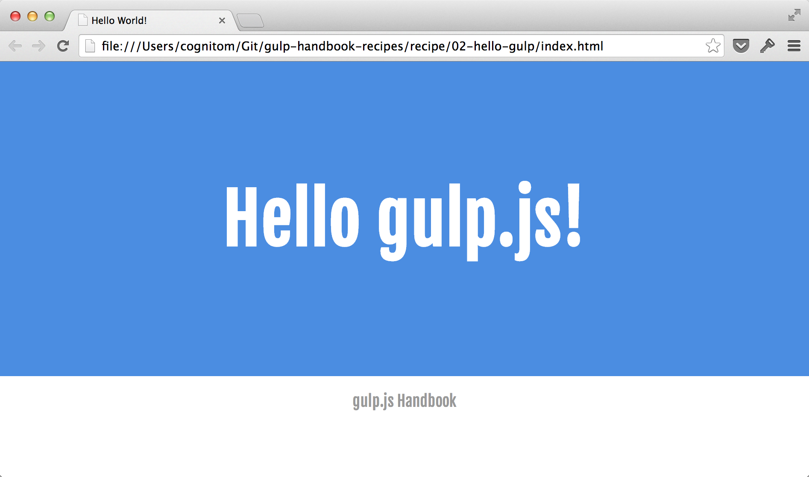

# Hello gulp.js

This example is a part of [Recipes in gulp.js Handbook](https://github.com/cognitom/gulp-handbook-recipes/).



## Install

[Download this example](https://github.com/cognitom/gulp-handbook-recipes/raw/master/download/02-hello-gulp.zip).

```bash
$ cd path/to/02-hello-gulp/
$ npm install
$ gulp style
```

Then, open [index.html](index.html) by the browser.


## gulp.js Plugins

- [gulp-cssimport](https://www.npmjs.org/package/gulp-cssimport)
- [gulp-autoprefixer](https://www.npmjs.org/package/gulp-autoprefixer)
- [gulp-minify-css](https://www.npmjs.org/package/gulp-minify-css)
- [gulp-rename](https://www.npmjs.org/package/gulp-rename)
